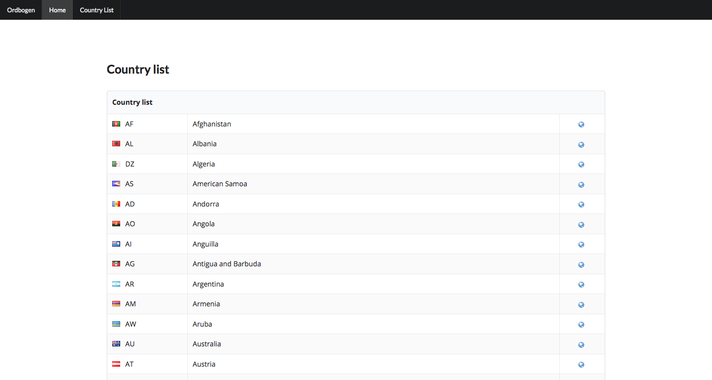
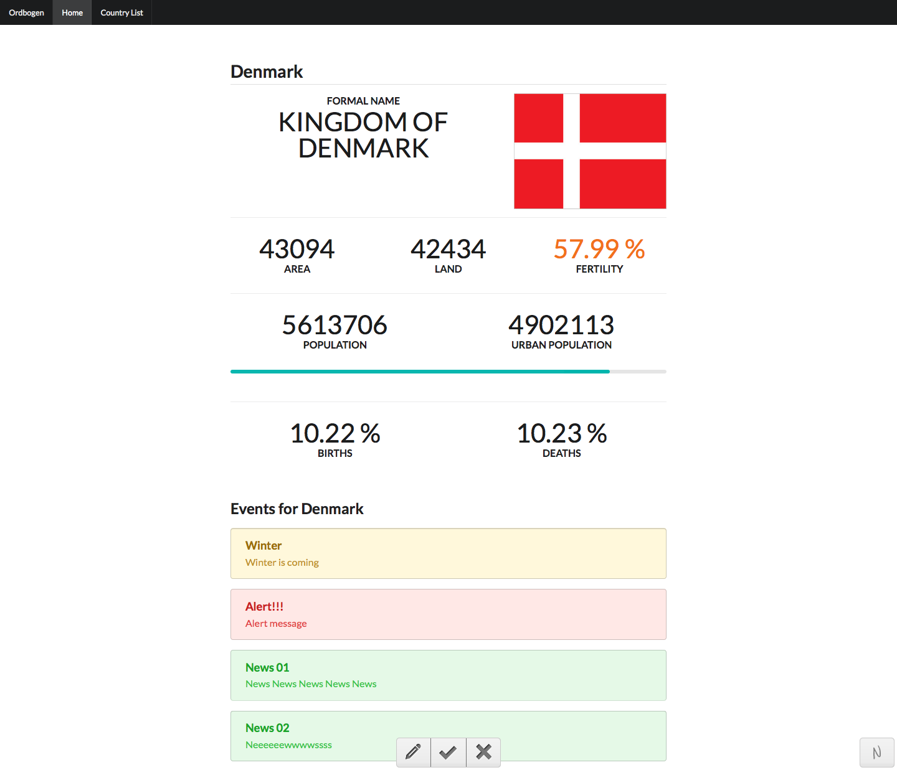

# Web Documentations

## List

```
http://127.0.0.1:5000/country
```

This is a table with all Countries, with a link to the specific page




## Country Page 
```
http://127.0.0.1:5000/country/ISO_CODE
```


Page for each country, with basic information and events


